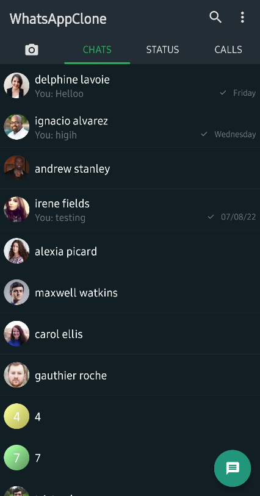
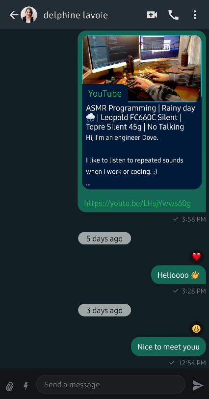
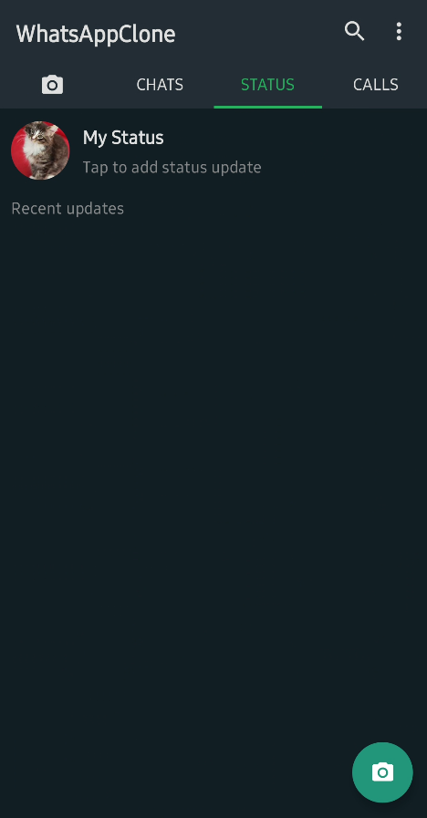
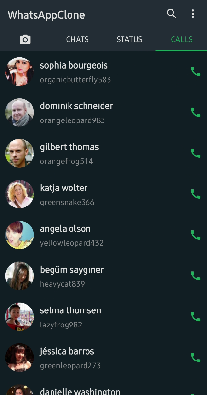
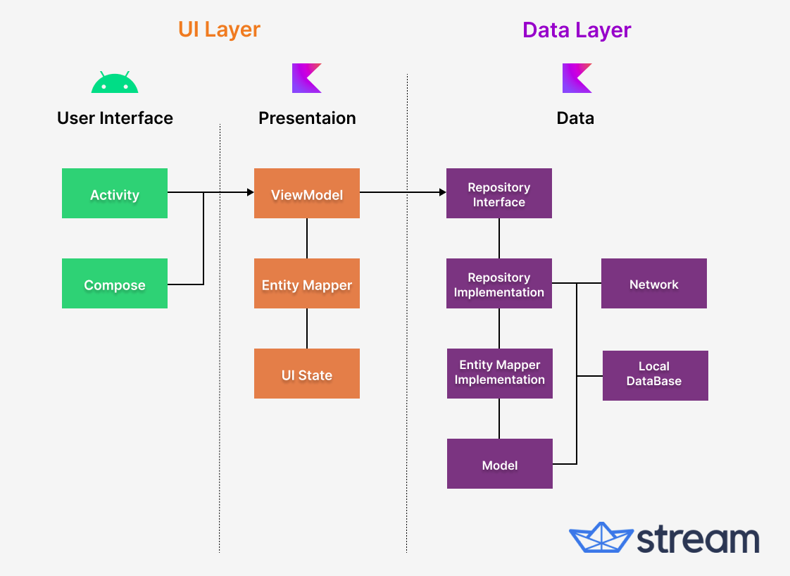
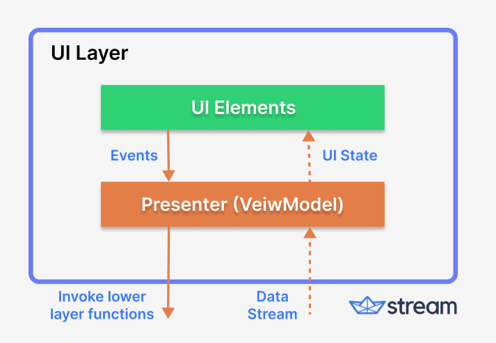

<p align="center">
  <a href="https://opensource.org/licenses/Apache-2.0"></a>
  <a href="https://android-arsenal.com/api?level=21"></a>
  <a href="https://github.com/GetStream/whatsapp-clone-compose/actions/workflows/android.yml"></a>
  <a href="https://getstream.io?utm_source=Github&utm_medium=Github_Repo_Content_Ad&utm_content=Developer&utm_campaign=Github_Dec2022_Jaewoong&utm_term=DevRelOss"></a>
</p>

This is a [WhatsApp](https://www.whatsapp.com/) clone app built with Jetpack Compose and [Stream Chat SDK for Compose](https://getstream.io/chat/sdk/compose?utm_source=Github&utm_medium=Github_Repo_Content_Ad&utm_content=Developer&utm_campaign=Github_Dec2022_Jaewoong&utm_term=DevRelOss).

The purpose of this repository is to demonstrate below:

- Implementing entire UI elements with Jetpack Compose.
- Implementation of Android architecture components with Jetpack libraries such as Hilt and AppStartup.
- Performing background tasks with Kotlin Coroutines.
- Integrating chat systems with Stream Chat SDK for real-time event handling.

## ✍️ Technical Content

If you're interested in the overall architecture, each layer, and Compose themes that are used in this project, check out **[Build a Real-Time WhatsApp Clone With Jetpack Compose](https://getstream.io/blog/build-whatsapp-clone/)**.

## :bulb: Additional Repositories

If you're interested in additional repositories that were built with Jetpack Compose and Stream SDK, check out the repositories below:

- [ChatGPT Android](https://github.com/skydoves/chatgpt-android): 📱 ChatGPT Android demonstrates OpenAI's ChatGPT on Android with Stream Chat SDK for Compose.
- [Slack Clone Android](https://github.com/GetStream/stream-slack-clone-android): 📱 A chat demo app built with Jetpack Compose and Stream Chat SDK following clean architecture principles.
- [Stream Draw Android](https://github.com/getStream/stream-draw-android): 🛥 Stream Draw is a real-time multiplayer drawing & chat game app built entirely with Jetpack Compose.
- [Facebook Messenger Clone](https://github.com/MathRoda/Messenger-clone): Facebook Messenger clone using Stream SDK & Jetpack Compose.

## 📲 Download APK
Go to the [Releases](https://github.com/GetStream/whatsapp-clone-compose/releases) to download the latest APK.

<a href="https://getstream.io/chat/sdk/compose?utm_source=Github&utm_medium=Github_Repo_Content_Ad&utm_content=Developer&utm_campaign=Github_Dec2022_Jaewoong&utm_term=DevRelOss">

</a>

## 🛥 Stream Chat SDK
**WhatsApp Clone Compose** is built with __[Stream Chat SDK for Compose](https://getstream.io/chat/sdk/compose?utm_source=Github&utm_medium=Github_Repo_Content_Ad&utm_content=Developer&utm_campaign=Github_Dec2022_Jaewoong&utm_term=DevRelOss)__ to implement messaging systems.
If you’re interested in adding powerful In-App Messaging to your app, check out the __[Android Chat Messaging Tutorial](https://getstream.io/tutorials/android-chat?utm_source=Github&utm_medium=Github_Repo_Content_Ad&utm_content=Developer&utm_campaign=Github_Dec2022_Jaewoong&utm_term=DevRelOss)__!

- [Stream Chat SDK for Android on GitHub](https://github.com/getStream/stream-chat-android)
- [Android Samples for Stream Chat SDK on GitHub](https://github.com/getStream/android-samples)
- [Stream Chat Compose UI Componenets Guidelines](https://getstream.io/chat/docs/sdk/android/compose/overview/)

## 💻 Build Your Own Chat Project

<details>
 <summary> If you want to build your own chat project, you should follow the instructions below:</summary>

<de>

1. Go to the __[Stream login page](https://getstream.io/try-for-free?utm_source=Github&utm_medium=Github_Repo_Content_Ad&utm_content=Developer&utm_campaign=Github_Dec2022_Jaewoong_ChatGPT&utm_term=DevRelOss)__.
2. If you have your GitHub account, click the **SIGN UP WITH GITHUB** button and you can sign up within a couple of seconds. 


3. If you don't have a GitHub account, fill in the inputs and click the **START FREE TRIAL** button.
4. Go to the __[Dashboard](https://dashboard.getstream.io?utm_source=Github&utm_medium=Github_Repo_Content_Ad&utm_content=Developer&utm_campaign=Github_Dec2022_Jaewoong_ChatGPT&utm_term=DevRelOss)__ and click the **Create App** button like the below.


5. Fill in the blanks like the below and click the **Create App** button.


6. You will see the **Key** like the figure below and then copy it.


7. Go to the [whatsApp-clone-compose/features/chats/../strings.xml](https://github.com/GetStream/whatsApp-clone-compose/blob/main/features/chats/src/main/res/values/strings.xml#LL19C16-L19C30) and change the `stream_api_key` field with your key.

8. Build and run the project.

</details>

## 📷 Previews

<p align="center">


</br>



</p>

## 🛠 Tech Stack & Open Source Libraries
- Minimum SDK level 21.
- 100% [Jetpack Compose](https://developer.android.com/jetpack/compose) based + [Coroutines](https://github.com/Kotlin/kotlinx.coroutines) + [Flow](https://kotlin.github.io/kotlinx.coroutines/kotlinx-coroutines-core/kotlinx.coroutines.flow/) for asynchronous.
- [Compose Chat SDK for Messaging](https://getstream.io/chat/sdk/compose?utm_source=Github&utm_medium=Github_Repo_Content_Ad&utm_content=Developer&utm_campaign=Github_Dec2022_Jaewoong&utm_term=DevRelOss): The Jetpack Compose Chat Messaging SDK is built on a low-level chat client and provides modular, customizable Compose UI components that you can easily drop into your app.
- Jetpack
  - Compose: Android’s modern toolkit for building native UI.
  - ViewModel: UI related data holder and lifecycle aware.
  - App Startup: Provides a straightforward, performant way to initialize components at application startup.
  - Navigation: For navigating screens and [Hilt Navigation Compose](https://developer.android.com/jetpack/compose/libraries#hilt) for injecting dependencies.
  - Room: Constructs Database by providing an abstraction layer over SQLite to allow fluent database access.
  - [Hilt](https://dagger.dev/hilt/): Dependency Injection.
- [Landscapist Glide](https://github.com/skydoves/landscapist#glide), [animation](https://github.com/skydoves/landscapist#animation), [placeholder](https://github.com/skydoves/landscapist#placeholder): Jetpack Compose image loading library that fetches and displays network images with Glide, Coil, and Fresco.
- [accompanist](https://github.com/google/accompanist): A collection of extension libraries for Jetpack Compose
- [Retrofit2 & OkHttp3](https://github.com/square/retrofit): Construct the REST APIs and paging network data.
- [Retrofit adapters](https://github.com/skydoves/retrofit-adapters): Retrofit adapters for modeling network responses with Kotlin Result, Jetpack Paging3, and Arrow Either.
- [ksp](https://github.com/google/ksp): Kotlin Symbol Processing API.
- [sealedx](https://github.com/skydoves/sealedx): Kotlin Symbol Processor to auto-generate extensive sealed classes and interfaces.
- [StreamLog](https://github.com/GetStream/stream-log): A lightweight and extensible logger library for Kotlin and Android.
- Baseline Profiles: To improve app performance by including a list of classes and methods specifications in your APK that can be used by Android Runtime.

## 🏛️ Architecture

**WhatsApp Clone Compose** follows the [Google's official architecture guidance](https://developer.android.com/topic/architecture).



**WhatsApp Clone Compose** was built with [Guide to app architecture](https://developer.android.com/topic/architecture), so it would be a great sample to show how the architecture works in real-world projects.<br>

The overall architecture is composed of two layers; UI Layer and the data layer. Each layer has dedicated components and they each have different responsibilities.
The arrow means the component has a dependency on the target component following its direction.

### Architecture Overview


Each layer has different responsibilities below. Basically, they follow [unidirectional event/data flow](https://developer.android.com/topic/architecture/ui-layer#udf).

### UI Layer



The UI Layer consists of UI elements like buttons, menus, tabs that could interact with users and [ViewModel](https://developer.android.com/topic/libraries/architecture/viewmodel) that holds app states and restores data when configuration changes.

### Data Layer


The data Layer consists of repositories, which include business logic, such as querying data from the local database and requesting remote data from the network. It is implemented as an offline-first source of business logic and follows the [single source of truth](https://en.wikipedia.org/wiki/Single_source_of_truth) principle.<br>

For more information about the overall architecture, check out **[Build a Real-Time WhatsApp Clone With Jetpack Compose](https://getstream.io/blog/build-whatsapp-clone/)**.

## Modularization


**WhatsApp Clone Compose** adopted modularization strategies below:

- **Reusability**: Modulizing reusable codes properly enable opportunities for code sharing and limits code accessibility in other modules at the same time.

- **Parallel Building**: Each module can be run in parallel and it reduces the build time.

- **Decentralized focusing**: Each developer team can assign their dedicated module and they can focus on their own modules.


## 💯 MAD Score


## 🤝 Contribution

Most of the features are not completed except the chat feature, so anyone can contribute and improve this project following the [Contributing Guideline](https://github.com/GetStream/whatsapp-clone-compose/blob/main/CONTRIBUTING.md).

## Find this repository useful? 💙
Support it by joining __[stargazers](https://github.com/GetStream/whatsapp-clone-compose/stargazers)__ for this repository. :star: <br>
Also, follow __[maintainers](https://github.com/skydoves)__ on GitHub for our next creations! 🤩

# License
```xml
Copyright 2022 Stream.IO, Inc. All Rights Reserved.

Licensed under the Apache License, Version 2.0 (the "License");
you may not use this file except in compliance with the License.
You may obtain a copy of the License at

   http://www.apache.org/licenses/LICENSE-2.0

Unless required by applicable law or agreed to in writing, software
distributed under the License is distributed on an "AS IS" BASIS,
WITHOUT WARRANTIES OR CONDITIONS OF ANY KIND, either express or implied.
See the License for the specific language governing permissions and
limitations under the License.
```
